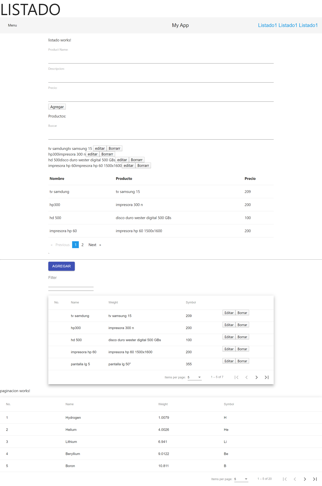

# Angular9-Crud


"# Angular9-pagination-search" 
"# Angular-9--search-pagination" 
## Search Filter Pipe - Busqueda para Angular 8/9
* https://www.npmjs.com/package/ng2-search-filter
* https://github.com/solodynamo/ng2-search-filter#readme
### Install
npm i ng2-search-filter --save
yarn add ng2-search-filter 
### Usage
In case you're using systemjs - see configuration here.

Import Ng2SearchPipeModule to your module
```
import { NgModule } from '@angular/core';
import { BrowserModule  } from '@angular/platform-browser';
import { AppComponent } from './app';
 
import { Ng2SearchPipeModule } from 'ng2-search-filter';
 
@NgModule({
  imports: [BrowserModule, Ng2SearchPipeModule],
  declarations: [AppComponent],
  bootstrap: [AppComponent]
})
export class AppModule {}
```
And use pipe in your component
```
import { Component } from '@angular/core';
 
@Component({
  selector: 'example-app',
  template: `
    <div>
        <input type="text" [(ngModel)]="term">
        <div *ngFor = "let item of items |filter:term" >
          <p>
            {{item.name}}
          </p>
        </div>
 
    </div>  
  `
})
 
export class AppComponent {
  items: string[] = [{ name: "archie" }, { name: "jake" }, { name: "richard" }];
}
```
Support ng2-search-filter
## ngx-pagination -Pagination for Angular
* https://www.npmjs.com/package/ngx-pagination
* https://github.com/michaelbromley/ngx-pagination#readme
### Simple Example
```
// app.module.ts
import {NgModule} from '@angular/core';
import {BrowserModule} from '@angular/platform-browser';
import {NgxPaginationModule} from 'ngx-pagination'; // <-- import the module
import {MyComponent} from './my.component';
 
@NgModule({
    imports: [BrowserModule, NgxPaginationModule], // <-- include it in your app module
    declarations: [MyComponent],
    bootstrap: [MyComponent]
})
export class MyAppModule {}
```
*****************
```
// my.component.ts
import {Component} from '@angular/core';
 
@Component({
    selector: 'my-component',
    template: `
    <ul>
      <li *ngFor="let item of collection | paginate: { itemsPerPage: 10, currentPage: p }"> ... </li>
    </ul>
               
    <pagination-controls (pageChange)="p = $event"></pagination-controls>
    `
})
export class MyComponent {
    p: number = 1;
    collection: any[] = someArrayOfThings;  
}
```
### API
PaginatePipe
The PaginatePipe should be placed at the end of an NgFor expression. It accepts a single argument, an object conforming to the PaginationInstance interface. The following config options are available:
```
<some-element *ngFor="let item of collection | paginate: { id: 'foo',
                                                      itemsPerPage: pageSize,
                                                      currentPage: p,
                                                      totalItems: total }">...</some-element>
 ```
* itemsPerPage [number] - required The number of items to display on each page.
* currentPage [number] - required The current (active) page number.
* id [string] If you need to support more than one instance of pagination at a time, set the id and ensure it matches the id attribute of the PaginationControlsComponent / PaginationControlsDirective (see below).
* totalItems [number] The total number of items in the collection. Only useful when doing server-side paging, where the collection size is limited to a single page returned by the server API. For in-memory paging, this property should not be set, as it will be automatically set to the value of collection.length.

## How to use Materialize CSS in Angular 7-8-9

* Install the materialize-css node package in your application. 
```
npm install materialize-css --save
```
* Open angular.json file & add below styles & scripts.
 ```
   "styles": [
          "./node_modules/materialize-css/dist/css/materialize.css",
        ],
   "scripts": [
          "./node_modules/materialize-css/dist/js/materialize.js"
        ]
   ``` 
     
 * To install css and javascript script.
 To import the angular material theme and javascript scripts , include the given below code to your src > index.html file.
   
 ```  
    <!doctype html>
<html lang="en">
<head>
  <meta charset="utf-8">
  <title>Borrar</title>
  <base href="/">
  <meta name="viewport" content="width=device-width, initial-scale=1">
  <link rel="icon" type="image/x-icon" href="favicon.ico">
  <link href="https://fonts.googleapis.com/icon?family=Material+Icons" rel="stylesheet">
</head>
<body>
  <app-root></app-root>
  <script>
  document.addEventListener('DOMContentLoaded', function() {
    var elems = document.querySelectorAll('.sidenav');
    var instances = M.Sidenav.init(elems, {});
  });
  </script>
</body>
</html>
```
## ng-modal - A simple, lightweight interface for creating layered modal dialogs in Angular 6+

Installation
Install the npm module:
```
$ npm install @browninglogic/ng-modal --save
```
Then import ModalManagerModule:
```
import { ModalManagerModule } from '@browninglogic/ng-modal';

@NgModule({
  declarations: [
    AppComponent
  ],
  imports: [
    BrowserModule,
    ModalManagerModule
  ],
  providers: [],
  bootstrap: [ AppComponent ]
})
export class AppModule {}

```

Use the following syntax for declaring a modal-window component within your app
```
<nm-modal-window #layeredExample1>
  <h1 header>You can put stuff in the header</h1>
  <div body>
    <p>Modal body paragraph text</p>
    <input type="button" value="Show Another Modal" (click)="layeredExample2.show()" />
  </div>
  <div footer>You can also put stuff in the footer</div>
</nm-modal-window>

<nm-modal-window #layeredExample2>
  <h1 header>Another Modal</h1>
  <div body>
    <p>I'm layered on top of the first modal!  Wow!</p>
    <input type="button" value="Close Me" (click)="layeredExample2.hide()" />
  </div>
</nm-modal-window>

<nm-modal-window #closeOnOverlayClickExample [closeOnOverlayClick]="true" [showCloseButton]="false">
  <div body>
    <p>This modal doesn't show a close button, but it will close if you click on the grey overlay.</p>
  </div>
</nm-modal-window>

<nm-modal-window #closeButtonExample [closeOnOverlayClick]="false" [showCloseButton]="true">
  <div body>
    <p>This modal shows a close button, but it will not close if you click on the grey overlay.</p>
  </div>
</nm-modal-window>

<nm-modal-window #onlyCloseProgrammaticallyExample [closeOnOverlayClick]="false" [showCloseButton]="false">
  <div body>
    <p>
      This modal doesn't show a close button and it will not close if you click on the grey overlay.
      It will only close if you call modalInstance.hide() on the component instance.  This is useful
      if you want to implement your own close button or lock the screen to prevent the user
      from interacting with the page behind the modal.
    </p>
    <input type="button" value="Close Me" (click)="onlyCloseProgrammaticallyExample.hide()" />
  </div>
</nm-modal-window>

<nm-modal-window #customStylingExample modalClass="custom-styling-modal" overlayClass="custom-styling-overlay">
  <div body>
    <p>
      This modal uses custom styling to change the border color of the modal window, 
      the opacity of the overlay, and the font color.
    </p>
  </div>
</nm-modal-window>
```
* closeOnOverlayClick (optional) - Specifies whether the modal will close itself when you click outside of the modal. Defaults to true.
* showCloseButton (optional) - Specifies whether to show a close button in the top right corner of the window. Defaults to false.
* modalClass (optional) - Specifies css class(es) to apply to the modal window. For example, if you want to override the border styling, change the background color, or specify a certain width, then that css would be applied here.
* overlayClass (optional) - Specifies css class(es) to apply to the modal window. For example, if you want the background overlay to use a different color or opacity, then that css would be applied here.
